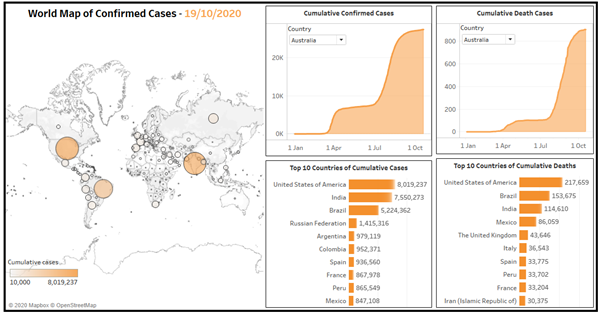

# COVID-19-Visualization
We created a simple Tableau Dashboard to the study trend and factors affecting the COVID-19 pandemic. 

A simple Tableau dashboard is created which will take real time data from the web to show the trend of COVID-19 Confirmed and Death cases all over the world. We also tried to study if we can predict the number of cases in near future based on simple ML techniques like Linear and Polynomial Regression. These predictions are not 100% true but the motive behind this experiment is to check the complexity of the data.

The data is extracted at real time from https://github.com/CSSEGISandData/COVID-19 

